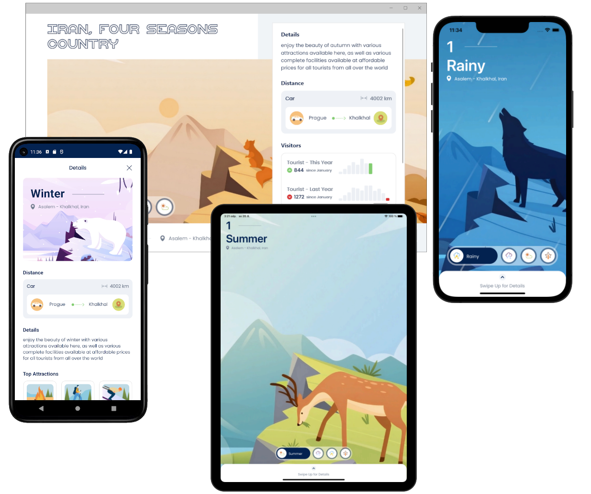
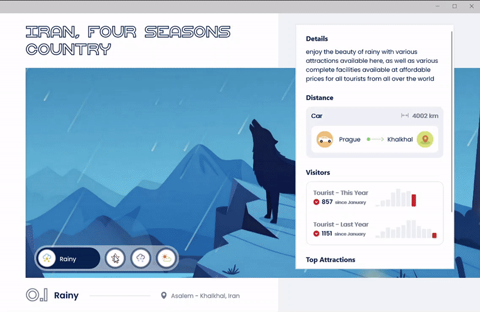

# FourSeasons
**.NET MAUI** implementation of [4 seasons mobile ui](https://dribbble.com/shots/15480534-4-seasons-mobile-ui) design by [Riko Sapto Dimo](https://dribbble.com/RikoSapto).

  

This project demonstrates how to create .NET MAUI apps with tailored UI using **.NET MAUI APIs only**.

## Original design

## Installation

First, make sure you have your Visual Studio and .NET 8 environment set up for .NET MAUI development. If not, follow the [setup instructions](https://learn.microsoft.com/dotnet/maui/get-started/installation). Then make sure you have your [Android](https://learn.microsoft.com/dotnet/maui/get-started/first-app?pivots=devices-android) or [iOS](https://learn.microsoft.com/dotnet/maui/get-started/first-app?pivots=devices-ios) platform set up for deployment of the application.

Once everything is set up, you can clone the repo and run the application via Visual Studio or Visual Studio Code.

Here are some resources to learn more about .NET MAUI:

- [Official website](https://dotnet.microsoft.com/apps/maui)
- [Microsoft Learn](https://learn.microsoft.com/dotnet/maui/what-is-maui)
- [.NET MAUI GitHub repository](https://github.com/dotnet/maui)

## Features

The application was built using .NET MAUI only, no additional packages were used.

  
 
  

